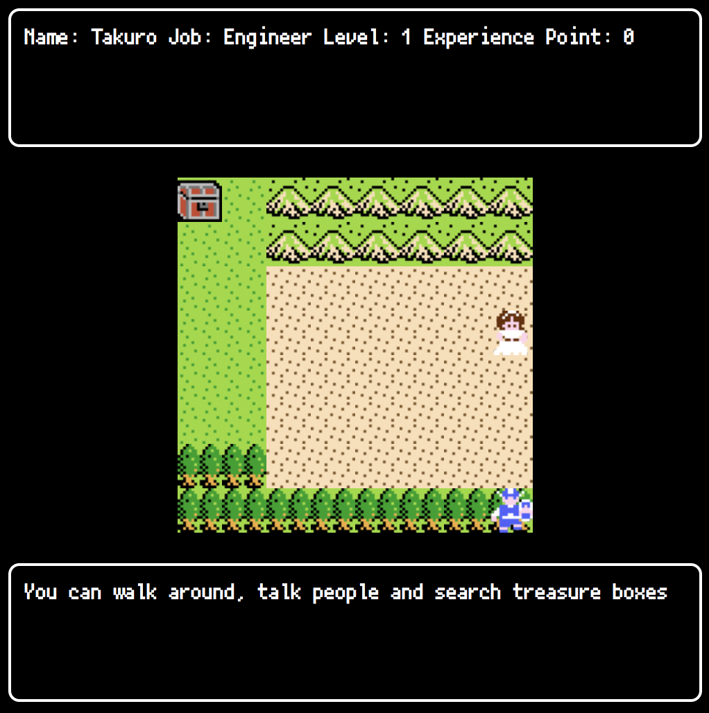

# RPG Portfolio Site

\*\* I made this site when I am in code chrysalis



## Why do I make this site

I wanted an interesting portfolio site that could be used for job hunting.
If the site is like a game, it will keep me motivated to keep updating it and I will be able to connect with people who have similar tastes.

## Future Feature

1. add my portfolios
1. use my own logo
1. write my experience and skills
1. implement more event
1. improve level up system
1. change this site to a responsive design site

## Project setup

```
yarn install
```

### Compiles and hot-reloads for development

```
yarn serve
```

### Compiles and minifies for production

```
yarn build
```

### Lints and fixes files

```
yarn lint
```

### Customize configuration

See [Configuration Reference](https://cli.vuejs.org/config/).
